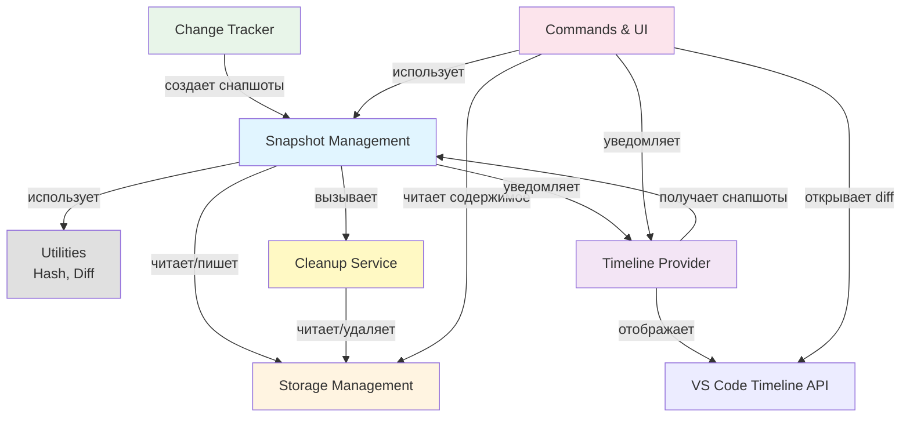
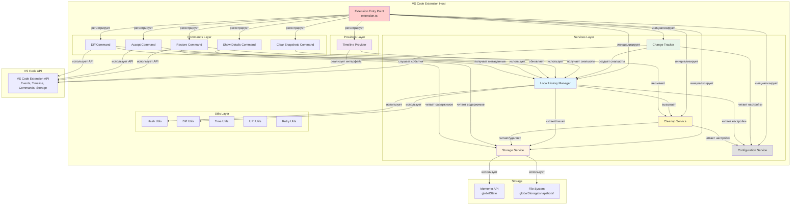

# Архитектура VS Code расширения "Changes Viewer"

## 1. Описание задачи

**Ссылка на ТЗ:** `subagent_output/technical_specification.md`

**Краткое резюме требований:**

Разработать VS Code расширение `changes_viewer`, которое реализует систему локального хранения и просмотра истории изменений файлов. Расширение должно:

- Автоматически отслеживать изменения файлов в редакторе (typing, save) и от внешних процессов (FileSystemWatcher)
- Создавать снапшоты с дедупликацией по хешу содержимого
- Отображать историю изменений через VS Code Timeline API
- Предоставлять команды для восстановления файлов, принятия изменений и сравнения версий
- Управлять хранилищем с учетом лимитов (количество, размер, TTL) и применять стратегию очистки LRU

**Покрываемые юзер-кейсы:**
- UC-01: Автоматическое создание снапшотов при вводе текста
- UC-02: Автоматическое создание снапшота при сохранении файла
- UC-03: Отслеживание изменений от внешних процессов
- UC-04: Просмотр истории изменений файла
- UC-05: Восстановление файла к версии из снапшота
- UC-06: Скрытие элемента истории (Accept)
- UC-07: Сравнение версии файла с текущей версией (Diff)
- UC-08: Просмотр детальной информации о снапшоте

---

## 2. Функциональная архитектура

### 2.1. Функциональные компоненты

#### Компонент: Управление снапшотами (Snapshot Management)

**Назначение:** Централизованное управление жизненным циклом снапшотов: создание, чтение, обновление, удаление.

**Функции:**

- **Функция 1: Создание снапшота**
  - Входные данные: URI файла, содержимое файла, источник изменения (typing/save/filesystem/manual), метаданные
  - Выходные данные: Объект Snapshot с ID, метаданными и путем к содержимому
  - Связанные юзер-кейсы: UC-01, UC-02, UC-03, UC-05
  - Логика: Вычисление хеша, проверка дедупликации, сохранение содержимого, создание метаданных, обновление индекса

- **Функция 2: Чтение снапшота**
  - Входные данные: ID снапшота или URI файла + timestamp
  - Выходные данные: Объект Snapshot с метаданными и содержимым
  - Связанные юзер-кейсы: UC-04, UC-05, UC-07, UC-08
  - Логика: Поиск в индексе, чтение метаданных, загрузка содержимого из файловой системы

- **Функция 3: Обновление метаданных снапшота**
  - Входные данные: ID снапшота, обновляемые поля (например, accepted, acceptedTimestamp)
  - Выходные данные: Обновленный объект Snapshot
  - Связанные юзер-кейсы: UC-06
  - Логика: Поиск снапшота, обновление полей, сохранение в индекс

- **Функция 4: Удаление снапшота**
  - Входные данные: ID снапшота или список ID
  - Выходные данные: Результат удаления (успех/ошибка)
  - Связанные юзер-кейсы: UC-01, UC-02, UC-03 (очистка при лимитах)
  - Логика: Удаление метаданных из индекса, удаление файла содержимого, обновление индекса

- **Функция 5: Получение списка снапшотов для файла**
  - Входные данные: URI файла, фильтры (accepted, source, date range), опции пагинации
  - Выходные данные: Массив объектов Snapshot, отсортированных по timestamp
  - Связанные юзер-кейсы: UC-04
  - Логика: Поиск в индексе по URI, применение фильтров, сортировка, пагинация

- **Функция 6: Проверка дедупликации**
  - Входные данные: URI файла, хеш содержимого
  - Выходные данные: Boolean (идентично ли содержимое последнему снапшоту)
  - Связанные юзер-кейсы: UC-01, UC-02, UC-03
  - Логика: Получение последнего снапшота для файла, сравнение хешей

- **Функция 7: Вычисление diff между снапшотами**
  - Входные данные: ID снапшота 1, ID снапшота 2 (или текущее содержимое файла)
  - Выходные данные: Объект DiffInfo с количеством добавленных/удаленных/измененных строк
  - Связанные юзер-кейсы: UC-01, UC-02, UC-03, UC-07
  - Логика: Загрузка содержимого обоих снапшотов, вычисление различий через diff-алгоритм

**Зависимости:**
- Зависит от: Storage Service (для чтения/записи данных)
- Зависит от: Hash Service (для вычисления хешей)
- Зависит от: Diff Service (для вычисления различий)
- От него зависят: Change Tracker, Timeline Provider, Commands

---

#### Компонент: Отслеживание изменений (Change Tracking)

**Назначение:** Отслеживание изменений файлов в реальном времени через события редактора и файловой системы.

**Функции:**

- **Функция 1: Отслеживание изменений в редакторе (typing)**
  - Входные данные: Событие `onDidChangeTextDocument` от VS Code
  - Выходные данные: Событие создания снапшота (через debounce)
  - Связанные юзер-кейсы: UC-01
  - Логика: Регистрация обработчика, debounce (2 сек), получение содержимого из редактора (включая dirty state), создание снапшота

- **Функция 2: Отслеживание сохранения файла**
  - Входные данные: Событие `onDidSaveTextDocument` от VS Code
  - Выходные данные: Событие создания снапшота
  - Связанные юзер-кейсы: UC-02
  - Логика: Регистрация обработчика, чтение сохраненного файла с диска, создание снапшота

- **Функция 3: Отслеживание изменений от внешних процессов**
  - Входные данные: События `onDidChange`, `onDidCreate`, `onDidDelete` от FileSystemWatcher
  - Выходные данные: Событие создания снапшота (через debounce)
  - Связанные юзер-кейсы: UC-03
  - Логика: Регистрация FileSystemWatcher, фильтрация временных файлов, проверка dirty state, debounce (1 сек), чтение файла с диска, создание снапшота

- **Функция 4: Фильтрация временных файлов**
  - Входные данные: URI файла
  - Выходные данные: Boolean (является ли файл временным)
  - Связанные юзер-кейсы: UC-03
  - Логика: Проверка пути на соответствие паттернам временных файлов (`.tmp`, `.temp`, `.swp`, `.git`, `node_modules` и т.д.)

- **Функция 5: Проверка dirty state файла**
  - Входные данные: URI файла
  - Выходные данные: Boolean (имеет ли файл несохраненные изменения)
  - Связанные юзер-кейсы: UC-03
  - Логика: Проверка открытых документов в VS Code на наличие dirty state

**Зависимости:**
- Зависит от: VS Code Extension API (onDidChangeTextDocument, onDidSaveTextDocument, createFileSystemWatcher)
- Зависит от: Snapshot Management (для создания снапшотов)
- От него зависят: (нет прямых зависимостей, работает через события)

---

#### Компонент: Управление хранилищем (Storage Management)

**Назначение:** Абстракция над механизмами хранения данных (Memento API для метаданных, файловая система для содержимого).

**Функции:**

- **Функция 1: Сохранение метаданных снапшота**
  - Входные данные: Объект Snapshot
  - Выходные данные: Результат сохранения (успех/ошибка)
  - Связанные юзер-кейсы: UC-01, UC-02, UC-03, UC-05, UC-06
  - Логика: Чтение текущего индекса из Memento, добавление/обновление снапшота, сохранение обратно в Memento

- **Функция 2: Чтение метаданных снапшота**
  - Входные данные: ID снапшота или URI файла
  - Выходные данные: Объект Snapshot или массив Snapshot
  - Связанные юзер-кейсы: UC-04, UC-05, UC-07, UC-08
  - Логика: Чтение индекса из Memento, поиск по ID или URI, возврат метаданных

- **Функция 3: Сохранение содержимого снапшота**
  - Входные данные: ID снапшота, содержимое файла (строка или Buffer), хеш файла
  - Выходные данные: Путь к сохраненному файлу
  - Связанные юзер-кейсы: UC-01, UC-02, UC-03
  - Логика: Определение пути к файлу (по хешу URI), создание директорий, запись содержимого, возврат пути

- **Функция 4: Чтение содержимого снапшота**
  - Входные данные: Путь к файлу содержимого (contentPath)
  - Выходные данные: Содержимое файла (строка)
  - Связанные юзер-кейсы: UC-05, UC-07
  - Логика: Чтение файла из файловой системы, обработка ошибок (файл не найден, поврежден)

- **Функция 5: Удаление содержимого снапшота**
  - Входные данные: Путь к файлу содержимого
  - Выходные данные: Результат удаления
  - Связанные юзер-кейсы: UC-01, UC-02, UC-03 (очистка)
  - Логика: Удаление файла из файловой системы, удаление пустых директорий

- **Функция 6: Вычисление размера хранилища**
  - Входные данные: (нет)
  - Выходные данные: Размер хранилища в байтах
  - Связанные юзер-кейсы: UC-01, UC-02, UC-03 (проверка лимитов)
  - Логика: Рекурсивный обход директории snapshots, суммирование размеров файлов

- **Функция 7: Получение пути к хранилищу**
  - Входные данные: (нет)
  - Выходные данные: Абсолютный путь к директории хранилища
  - Связанные юзер-кейсы: Все
  - Логика: Использование `context.globalStoragePath` для получения пути к `globalStorage/{extensionId}`

**Зависимости:**
- Зависит от: VS Code Extension API (context.globalState, context.globalStoragePath)
- Зависит от: Node.js fs API (для работы с файловой системой)
- От него зависят: Snapshot Management, Cleanup Service

---

#### Компонент: Очистка хранилища (Cleanup Service)

**Назначение:** Управление лимитами хранилища и автоматическая очистка старых снапшотов.

**Функции:**

- **Функция 1: Проверка лимитов хранилища**
  - Входные данные: (нет)
  - Выходные данные: Объект с информацией о превышении лимитов (количество, размер, TTL)
  - Связанные юзер-кейсы: UC-01, UC-02, UC-03
  - Логика: Подсчет снапшотов на файл, вычисление общего размера, проверка TTL, сравнение с лимитами

- **Функция 2: Очистка по лимиту количества снапшотов на файл**
  - Входные данные: URI файла, максимальное количество снапшотов
  - Выходные данные: Количество удаленных снапшотов
  - Связанные юзер-кейсы: UC-01, UC-02, UC-03
  - Логика: Получение всех снапшотов для файла, сортировка по timestamp (старые первыми), удаление лишних

- **Функция 3: Очистка по лимиту размера хранилища (LRU)**
  - Входные данные: Текущий размер, максимальный размер
  - Выходные данные: Количество удаленных снапшотов, освобожденное место
  - Связанные юзер-кейсы: UC-01, UC-02, UC-03
  - Логика: Вычисление размера каждого снапшота, сортировка по времени последнего доступа (LRU), удаление до достижения лимита

- **Функция 4: Очистка по TTL**
  - Входные данные: TTL в днях
  - Выходные данные: Количество удаленных снапшотов
  - Связанные юзер-кейсы: UC-01, UC-02, UC-03 (периодическая очистка)
  - Логика: Поиск снапшотов старше TTL, фильтрация принятых снапшотов (не удалять accepted: true), удаление

- **Функция 5: Периодическая очистка**
  - Входные данные: Интервал очистки (по умолчанию 24 часа)
  - Выходные данные: (нет, выполняется в фоне)
  - Связанные юзер-кейсы: UC-01, UC-02, UC-03
  - Логика: Регистрация таймера, периодический запуск очистки по TTL и лимитам

- **Функция 6: Ручная очистка**
  - Входные данные: Параметры очистки (возраст, размер, принятые)
  - Выходные данные: Результат очистки (количество удаленных)
  - Связанные юзер-кейсы: (команда пользователя)
  - Логика: Применение фильтров, удаление соответствующих снапшотов

**Зависимости:**
- Зависит от: Storage Management (для чтения/удаления снапшотов)
- Зависит от: Snapshot Management (для удаления снапшотов)
- От него зависят: (нет прямых зависимостей, вызывается из Snapshot Management)

---

#### Компонент: Timeline Provider

**Назначение:** Интеграция с VS Code Timeline API для отображения истории изменений в стандартном Timeline view.

**Функции:**

- **Функция 1: Предоставление Timeline items для файла**
  - Входные данные: URI файла, опции Timeline (временной диапазон, количество)
  - Выходные данные: Массив TimelineItem для VS Code Timeline API
  - Связанные юзер-кейсы: UC-04
  - Логика: Получение снапшотов для файла из Snapshot Management, фильтрация принятых, преобразование в TimelineItem, сортировка по timestamp

- **Функция 2: Уведомление об изменении Timeline**
  - Входные данные: URI файла или список URI
  - Выходные данные: (нет, событие для VS Code)
  - Связанные юзер-кейсы: UC-01, UC-02, UC-03, UC-06
  - Логика: Эмиссия события `onDidChange` для обновления Timeline view

- **Функция 3: Форматирование снапшота в TimelineItem**
  - Входные данные: Объект Snapshot
  - Выходные данные: Объект TimelineItem
  - Связанные юзер-кейсы: UC-04
  - Логика: Преобразование метаданных снапшота в формат Timeline API (id, label, timestamp, iconPath, description, command)

**Зависимости:**
- Зависит от: VS Code Extension API (Timeline API)
- Зависит от: Snapshot Management (для получения снапшотов)
- От него зависят: (нет, используется VS Code через Timeline API)

---

#### Компонент: Команды и UI (Commands & UI)

**Назначение:** Реализация команд расширения для взаимодействия пользователя с историей изменений.

**Функции:**

- **Функция 1: Команда Restore (восстановление файла)**
  - Входные данные: ID снапшота или URI файла + timestamp
  - Выходные данные: Результат восстановления (успех/ошибка)
  - Связанные юзер-кейсы: UC-05
  - Логика: Получение снапшота, проверка dirty state, диалог подтверждения, создание снапшота текущей версии, запись содержимого снапшота в файл, обновление редактора

- **Функция 2: Команда Accept (принятие изменения)**
  - Входные данные: ID снапшота или список ID
  - Выходные данные: Результат принятия
  - Связанные юзер-кейсы: UC-06
  - Логика: Обновление метаданных снапшота (accepted: true), сохранение в Storage, уведомление Timeline Provider

- **Функция 3: Команда Diff (сравнение версий)**
  - Входные данные: ID снапшота, URI текущего файла
  - Выходные данные: Открытый Diff-редактор VS Code
  - Связанные юзер-кейсы: UC-07
  - Логика: Получение содержимого снапшота, получение текущего содержимого файла (из редактора или диска), открытие Diff-редактора через VS Code API

- **Функция 4: Команда Show Details (детальная информация)**
  - Входные данные: ID снапшота
  - Выходные данные: Отображение детальной информации (в панели или уведомлении)
  - Связанные юзер-кейсы: UC-08
  - Логика: Получение метаданных снапшота, форматирование информации, отображение в UI

- **Функция 5: Команда Clear Old Snapshots (ручная очистка)**
  - Входные данные: Параметры очистки (опционально)
  - Выходные данные: Результат очистки
  - Связанные юзер-кейсы: (команда пользователя)
  - Логика: Вызов Cleanup Service с параметрами, отображение результата

**Зависимости:**
- Зависит от: VS Code Extension API (команды, диалоги, Diff-редактор)
- Зависит от: Snapshot Management (для работы со снапшотами)
- Зависит от: Storage Management (для чтения содержимого)
- От него зависят: (нет, используется VS Code через Command Palette и контекстные меню)

---

#### Компонент: Утилиты (Utilities)

**Назначение:** Вспомогательные функции, используемые другими компонентами.

**Функции:**

- **Функция 1: Вычисление хеша содержимого (SHA-256)**
  - Входные данные: Содержимое файла (строка или Buffer)
  - Выходные данные: SHA-256 хеш (строка)
  - Связанные юзер-кейсы: UC-01, UC-02, UC-03
  - Логика: Использование Node.js crypto API для вычисления SHA-256

- **Функция 2: Вычисление diff между двумя версиями**
  - Входные данные: Содержимое версии 1, содержимое версии 2
  - Выходные данные: Объект DiffInfo (addedLines, removedLines, modifiedLines)
  - Связанные юзер-кейсы: UC-01, UC-02, UC-03, UC-07
  - Логика: Использование алгоритма diff (например, на основе longest common subsequence) для вычисления различий

- **Функция 3: Форматирование времени**
  - Входные данные: Unix timestamp
  - Выходные данные: Отформатированная строка времени (например, "2 minutes ago")
  - Связанные юзер-кейсы: UC-04
  - Логика: Преобразование timestamp в относительное время

- **Функция 4: Валидация URI файла**
  - Входные данные: URI (строка или vscode.Uri)
  - Выходные данные: Boolean (валиден ли URI)
  - Связанные юзер-кейсы: Все
  - Логика: Проверка формата URI, проверка принадлежности к рабочей области

- **Функция 5: Обработка ошибок с повторными попытками**
  - Входные данные: Функция для выполнения, количество попыток, задержка
  - Выходные данные: Результат выполнения или ошибка
  - Связанные юзер-кейсы: UC-03 (чтение файлов)
  - Логика: Выполнение функции с обработкой ошибок, повтор при неудаче с экспоненциальной задержкой

**Зависимости:**
- Зависит от: Node.js crypto API (для хеширования)
- Зависит от: (нет других зависимостей, утилиты)
- От него зависят: Все компоненты (используют утилиты)

---

### 2.2. Диаграмма функциональных компонентов



---

## 3. Системная архитектура

### 3.1. Архитектурный стиль

**Выбранный стиль:** Модульная архитектура с разделением ответственности (Layered Architecture)

**Обоснование выбора:**

1. **Простота реализации:** VS Code расширения обычно имеют простую структуру без необходимости в сложных архитектурных паттернах
2. **Легкость сопровождения:** Четкое разделение компонентов упрощает понимание и модификацию кода
3. **Тестируемость:** Модульная структура позволяет легко тестировать компоненты изолированно
4. **Масштабируемость:** При необходимости можно легко добавить новые компоненты или рефакторить существующие
5. **Соответствие VS Code Extension API:** VS Code API естественно поддерживает модульную структуру через регистрацию провайдеров и команд

**Альтернативы, которые НЕ выбраны:**
- **Микросервисы:** Не применимо для VS Code расширения (все работает в одном процессе)
- **Event-driven:** Частично используется через события VS Code API, но не как основной паттерн
- **MVC/MVP:** Избыточно для расширения без сложного UI

---

### 3.2. Компоненты системы

#### Компонент: Extension Entry Point

**Тип:** VS Code Extension Activation Point

**Назначение:** Точка входа расширения, инициализация всех компонентов при активации.

**Реализуемые функции:** Инициализация всех сервисов, регистрация провайдеров и команд

**Технологии:** TypeScript, VS Code Extension API

**Интерфейсы:**
- Входящие: VS Code вызывает `activate()` при активации расширения
- Исходящие: Регистрирует Timeline Provider, команды, обработчики событий

**Зависимости:**
- VS Code Extension API (`vscode` модуль)
- Все внутренние компоненты системы

**Структура:**
```
src/
  extension.ts          # Точка входа, функция activate()
```

---

#### Компонент: Local History Manager

**Тип:** Backend Service (TypeScript класс)

**Назначение:** Управление жизненным циклом снапшотов (CRUD операции).

**Реализуемые функции:** Все функции компонента "Управление снапшотами" из функциональной архитектуры

**Технологии:** TypeScript, Node.js

**Интерфейсы:**
- Входящие: Методы `createSnapshot()`, `getSnapshot()`, `updateSnapshot()`, `deleteSnapshot()`, `getSnapshotsForFile()`
- Исходящие: Вызывает Storage Service, Hash Service, Diff Service, Cleanup Service

**Зависимости:**
- Storage Service (для чтения/записи)
- Hash Service (для вычисления хешей)
- Diff Service (для вычисления различий)
- Cleanup Service (для проверки лимитов)

**Структура:**
```
src/
  services/
    LocalHistoryManager.ts
```

**Ключевые методы:**
```typescript
class LocalHistoryManager {
  async createSnapshot(fileUri: vscode.Uri, content: string, source: SnapshotSource): Promise<Snapshot>
  async getSnapshot(snapshotId: string): Promise<Snapshot | null>
  async getSnapshotsForFile(fileUri: vscode.Uri, filters?: SnapshotFilters): Promise<Snapshot[]>
  async updateSnapshot(snapshotId: string, updates: Partial<Snapshot>): Promise<Snapshot>
  async deleteSnapshot(snapshotId: string): Promise<void>
  private async checkDeduplication(fileUri: vscode.Uri, contentHash: string): Promise<boolean>
  private async computeDiff(snapshot1: Snapshot, snapshot2: Snapshot): Promise<DiffInfo>
}
```

---

#### Компонент: Change Tracker

**Тип:** Event Handler Service

**Назначение:** Отслеживание изменений файлов через события VS Code и FileSystemWatcher.

**Реализуемые функции:** Все функции компонента "Отслеживание изменений" из функциональной архитектуры

**Технологии:** TypeScript, VS Code Extension API

**Интерфейсы:**
- Входящие: События от VS Code (`onDidChangeTextDocument`, `onDidSaveTextDocument`, FileSystemWatcher события)
- Исходящие: Вызывает Local History Manager для создания снапшотов

**Зависимости:**
- VS Code Extension API (события редактора и файловой системы)
- Local History Manager (для создания снапшотов)
- Configuration Service (для получения настроек debounce)

**Структура:**
```
src/
  services/
    ChangeTracker.ts
    DocumentWatcher.ts      # Обработка изменений в редакторе
    FileSystemWatcher.ts    # Обработка изменений от внешних процессов
```

**Ключевые методы:**
```typescript
class ChangeTracker {
  startTracking(): void
  stopTracking(): void
  private handleDocumentChange(event: vscode.TextDocumentChangeEvent): void
  private handleDocumentSave(event: vscode.TextDocument): void
  private handleFileSystemChange(uri: vscode.Uri): void
  private isTemporaryFile(uri: vscode.Uri): boolean
  private hasDirtyState(uri: vscode.Uri): boolean
}
```

---

#### Компонент: Storage Service

**Тип:** Data Access Layer

**Назначение:** Абстракция над механизмами хранения (Memento API + файловая система).

**Реализуемые функции:** Все функции компонента "Управление хранилищем" из функциональной архитектуры

**Технологии:** TypeScript, VS Code Extension API (Memento), Node.js fs API

**Интерфейсы:**
- Входящие: Методы `saveSnapshotMetadata()`, `getSnapshotMetadata()`, `saveSnapshotContent()`, `getSnapshotContent()`, `deleteSnapshotContent()`
- Исходящие: Читает/пишет в Memento API и файловую систему

**Зависимости:**
- VS Code Extension API (`context.globalState`, `context.globalStoragePath`)
- Node.js `fs` модуль
- Node.js `path` модуль

**Структура:**
```
src/
  services/
    StorageService.ts
```

**Ключевые методы:**
```typescript
class StorageService {
  async saveSnapshotMetadata(snapshot: Snapshot): Promise<void>
  async getSnapshotMetadata(snapshotId: string): Promise<Snapshot | null>
  async getSnapshotsForFile(fileUri: string): Promise<Snapshot[]>
  async saveSnapshotContent(snapshotId: string, content: string, fileHash: string): Promise<string>
  async getSnapshotContent(contentPath: string): Promise<string>
  async deleteSnapshotContent(contentPath: string): Promise<void>
  async getStorageSize(): Promise<number>
  getStoragePath(): string
}
```

---

#### Компонент: Cleanup Service

**Тип:** Background Service

**Назначение:** Управление лимитами хранилища и автоматическая очистка.

**Реализуемые функции:** Все функции компонента "Очистка хранилища" из функциональной архитектуры

**Технологии:** TypeScript, Node.js

**Интерфейсы:**
- Входящие: Методы `checkLimits()`, `cleanupByCount()`, `cleanupBySize()`, `cleanupByTTL()`, `startPeriodicCleanup()`
- Исходящие: Вызывает Storage Service и Local History Manager для удаления снапшотов

**Зависимости:**
- Storage Service (для получения информации о хранилище)
- Local History Manager (для удаления снапшотов)
- Configuration Service (для получения лимитов)

**Структура:**
```
src/
  services/
    CleanupService.ts
```

**Ключевые методы:**
```typescript
class CleanupService {
  async checkLimits(): Promise<LimitStatus>
  async cleanupByCount(fileUri: vscode.Uri, maxCount: number): Promise<number>
  async cleanupBySize(maxSize: number): Promise<number>
  async cleanupByTTL(ttlDays: number): Promise<number>
  startPeriodicCleanup(intervalHours: number): void
  stopPeriodicCleanup(): void
}
```

---

#### Компонент: Timeline Provider

**Тип:** VS Code Timeline Provider

**Назначение:** Интеграция с VS Code Timeline API для отображения истории.

**Реализуемые функции:** Все функции компонента "Timeline Provider" из функциональной архитектуры

**Технологии:** TypeScript, VS Code Extension API (Timeline API)

**Интерфейсы:**
- Входящие: VS Code вызывает `provideTimeline()` для получения Timeline items
- Исходящие: Эмитит события `onDidChange` для обновления Timeline view

**Зависимости:**
- VS Code Extension API (`TimelineProvider` интерфейс)
- Local History Manager (для получения снапшотов)

**Структура:**
```
src/
  providers/
    LocalHistoryTimelineProvider.ts
```

**Ключевые методы:**
```typescript
class LocalHistoryTimelineProvider implements vscode.TimelineProvider {
  provideTimeline(uri: vscode.Uri, options: vscode.TimelineOptions, token: vscode.CancellationToken): Promise<vscode.TimelineItem[]>
  onDidChange?: vscode.Event<vscode.TimelineChangeEvent>
  private formatSnapshotToTimelineItem(snapshot: Snapshot): vscode.TimelineItem
}
```

---

#### Компонент: Commands

**Тип:** VS Code Commands

**Назначение:** Реализация команд расширения для пользовательского взаимодействия.

**Реализуемые функции:** Все функции компонента "Команды и UI" из функциональной архитектуры

**Технологии:** TypeScript, VS Code Extension API

**Интерфейсы:**
- Входящие: VS Code вызывает команды через Command Palette или контекстные меню
- Исходящие: Использует VS Code API для диалогов, Diff-редактора, уведомлений

**Зависимости:**
- VS Code Extension API (команды, диалоги, Diff-редактор)
- Local History Manager (для работы со снапшотами)
- Storage Service (для чтения содержимого)

**Структура:**
```
src/
  commands/
    restoreCommand.ts      # Команда Restore
    acceptCommand.ts        # Команда Accept
    diffCommand.ts          # Команда Diff
    showDetailsCommand.ts   # Команда Show Details
    clearSnapshotsCommand.ts # Команда Clear Old Snapshots
```

**Регистрация команд:**
```typescript
// В extension.ts
vscode.commands.registerCommand('changes-viewer.restore', restoreCommand);
vscode.commands.registerCommand('changes-viewer.accept', acceptCommand);
vscode.commands.registerCommand('changes-viewer.diff', diffCommand);
vscode.commands.registerCommand('changes-viewer.showDetails', showDetailsCommand);
vscode.commands.registerCommand('changes-viewer.clearSnapshots', clearSnapshotsCommand);
```

---

#### Компонент: Configuration Service

**Тип:** Configuration Reader

**Назначение:** Чтение и валидация настроек расширения из VS Code Settings.

**Реализуемые функции:** Получение настроек (debounce, лимиты, TTL, максимальный размер файла)

**Технологии:** TypeScript, VS Code Extension API

**Интерфейсы:**
- Входящие: Чтение из `vscode.workspace.getConfiguration('changes-viewer')`
- Исходящие: Предоставляет типизированные настройки другим компонентам

**Зависимости:**
- VS Code Extension API (`workspace.getConfiguration`)

**Структура:**
```
src/
  services/
    ConfigurationService.ts
```

**Ключевые методы:**
```typescript
class ConfigurationService {
  getTypingDebounce(): number
  getFileSystemDebounce(): number
  getMaxSnapshotsPerFile(): number
  getMaxStorageSize(): number
  getTTLDays(): number
  getMaxFileSize(): number
  onDidChangeConfiguration(callback: () => void): vscode.Disposable
}
```

---

#### Компонент: Utilities

**Тип:** Utility Functions

**Назначение:** Вспомогательные функции (хеширование, diff, форматирование).

**Реализуемые функции:** Все функции компонента "Утилиты" из функциональной архитектуры

**Технологии:** TypeScript, Node.js crypto API

**Интерфейсы:**
- Входящие: Параметры функций
- Исходящие: Результаты вычислений

**Зависимости:**
- Node.js `crypto` модуль (для SHA-256)
- (для diff можно использовать простой алгоритм или библиотеку, но предпочтительно простое решение)

**Структура:**
```
src/
  utils/
    hash.ts          # Вычисление SHA-256
    diff.ts          # Вычисление diff
    time.ts          # Форматирование времени
    uri.ts           # Валидация URI
    retry.ts         # Повторные попытки
```

---

### 3.3. Диаграмма компонентов



---

## 4. Модель данных

### 4.1. Концептуальная модель данных

**Сущности:**

##### Сущность: Snapshot

**Описание:** Снапшот представляет собой сохраненную версию файла в определенный момент времени.

**Атрибуты:**
- `id` (string, UUID) — уникальный идентификатор снапшота
- `fileUri` (string) — URI файла (vscode.Uri.toString())
- `filePath` (string) — абсолютный путь к файлу
- `timestamp` (number) — Unix timestamp создания снапшота (миллисекунды)
- `source` (enum: 'typing' | 'save' | 'filesystem' | 'manual') — источник создания снапшота
- `contentHash` (string) — SHA-256 хеш содержимого (для дедупликации)
- `contentPath` (string) — относительный путь к файлу с содержимым снапшота
- `metadata` (object) — дополнительные метаданные:
  - `lineCount` (number) — количество строк в файле
  - `size` (number) — размер файла в байтах
  - `encoding` (string, optional) — кодировка файла
  - `deleted` (boolean, optional) — флаг удаления файла (для маркеров удаления)
  - `created` (boolean, optional) — флаг создания файла
  - `restoredFrom` (string, optional) — ID снапшота, из которого было выполнено восстановление
- `diffInfo` (object, optional) — информация об изменении:
  - `previousSnapshotId` (string, optional) — ID предыдущего снапшота
  - `addedLines` (number) — количество добавленных строк
  - `removedLines` (number) — количество удаленных строк
  - `modifiedLines` (number) — количество измененных строк
- `accepted` (boolean) — флаг "принято" (скрыто из списка)
- `acceptedTimestamp` (number, optional) — время принятия (если принято)

**Связи:**
- Один файл (fileUri) имеет много Snapshot (1:N)
- Один Snapshot может ссылаться на предыдущий Snapshot через `diffInfo.previousSnapshotId` (1:1, опционально)
- Один Snapshot может быть восстановлен из другого Snapshot через `metadata.restoredFrom` (1:1, опционально)

**Бизнес-правила:**
- `id` должен быть уникальным (UUID v4)
- `contentHash` используется для дедупликации (идентичное содержимое = одинаковый хеш)
- `accepted: true` означает, что снапшот скрыт из Timeline view, но не удален
- `source: 'manual'` используется при восстановлении файла (создается снапшот текущей версии перед восстановлением)
- `metadata.deleted: true` означает, что файл был удален (снапшот-маркер удаления)

---

##### Сущность: SnapshotIndex

**Описание:** Индекс для быстрого поиска снапшотов по файлу.

**Атрибуты:**
- `fileUri` (string) — URI файла (ключ)
- `snapshotIds` (string[]) — массив ID снапшотов для этого файла, отсортированных по timestamp

**Связи:**
- Один файл (fileUri) имеет один SnapshotIndex (1:1)
- Один SnapshotIndex содержит ссылки на много Snapshot (1:N через snapshotIds)

**Бизнес-правила:**
- Индекс обновляется при каждом создании/удалении снапшота
- snapshotIds отсортированы по timestamp (новые первыми)

---

##### Сущность: StorageMetadata

**Описание:** Метаданные хранилища (версия формата, статистика).

**Атрибуты:**
- `version` (string) — версия формата данных (для миграций)
- `totalSnapshots` (number, optional) — общее количество снапшотов (кэш)
- `totalSize` (number, optional) — общий размер хранилища в байтах (кэш)
- `lastCleanup` (number, optional) — timestamp последней очистки

**Связи:**
- (нет связей, это корневой объект)

**Бизнес-правила:**
- `version` используется для миграций при обновлении расширения
- Кэшированные значения (totalSnapshots, totalSize) обновляются при изменениях

---

### 4.2. Логическая модель данных

**Формат хранения:** JSON файлы + файловая система

#### Структура файла `snapshots.json` (в Memento API)

```json
{
  "version": "1.0",
  "metadata": {
    "totalSnapshots": 0,
    "totalSize": 0,
    "lastCleanup": null
  },
  "snapshots": [
    {
      "id": "550e8400-e29b-41d4-a716-446655440000",
      "fileUri": "file:///Users/user/project/src/file.ts",
      "filePath": "/Users/user/project/src/file.ts",
      "timestamp": 1704067200000,
      "source": "typing",
      "contentHash": "a665a45920422f9d417e4867efdc4fb8a04a1f3fff1fa07e998e86f7f7a27ae3",
      "contentPath": "snapshots/a1b2c3d4/550e8400-e29b-41d4-a716-446655440000.txt",
      "metadata": {
        "lineCount": 150,
        "size": 5432,
        "encoding": "utf-8"
      },
      "diffInfo": {
        "previousSnapshotId": "440e8400-e29b-41d4-a716-446655440001",
        "addedLines": 5,
        "removedLines": 2,
        "modifiedLines": 3
      },
      "accepted": false,
      "acceptedTimestamp": null
    }
  ],
  "index": {
    "file:///Users/user/project/src/file.ts": [
      "550e8400-e29b-41d4-a716-446655440000",
      "440e8400-e29b-41d4-a716-446655440001"
    ]
  }
}
```

**Описание полей:**

| Поле | Тип | Ограничения | Описание |
|------|-----|-------------|----------|
| version | string | NOT NULL | Версия формата данных |
| metadata | object | NOT NULL | Метаданные хранилища |
| metadata.totalSnapshots | number | >= 0 | Общее количество снапшотов (кэш) |
| metadata.totalSize | number | >= 0 | Общий размер в байтах (кэш) |
| metadata.lastCleanup | number \| null | >= 0 \| null | Timestamp последней очистки |
| snapshots | array | NOT NULL | Массив всех снапшотов |
| snapshots[].id | string | UUID, UNIQUE | Уникальный идентификатор |
| snapshots[].fileUri | string | NOT NULL | URI файла |
| snapshots[].filePath | string | NOT NULL | Абсолютный путь |
| snapshots[].timestamp | number | > 0 | Unix timestamp (мс) |
| snapshots[].source | string | enum | Источник: 'typing', 'save', 'filesystem', 'manual' |
| snapshots[].contentHash | string | SHA-256, NOT NULL | Хеш содержимого |
| snapshots[].contentPath | string | NOT NULL | Относительный путь к содержимому |
| snapshots[].metadata | object | NOT NULL | Дополнительные метаданные |
| snapshots[].metadata.lineCount | number | >= 0 | Количество строк |
| snapshots[].metadata.size | number | >= 0 | Размер в байтах |
| snapshots[].metadata.encoding | string | optional | Кодировка |
| snapshots[].metadata.deleted | boolean | optional | Флаг удаления |
| snapshots[].metadata.created | boolean | optional | Флаг создания |
| snapshots[].metadata.restoredFrom | string | UUID, optional | ID исходного снапшота |
| snapshots[].diffInfo | object | optional | Информация об изменении |
| snapshots[].diffInfo.previousSnapshotId | string | UUID, optional | ID предыдущего снапшота |
| snapshots[].diffInfo.addedLines | number | >= 0 | Добавленные строки |
| snapshots[].diffInfo.removedLines | number | >= 0 | Удаленные строки |
| snapshots[].diffInfo.modifiedLines | number | >= 0 | Измененные строки |
| snapshots[].accepted | boolean | NOT NULL, default: false | Флаг принятия |
| snapshots[].acceptedTimestamp | number \| null | >= 0 \| null | Timestamp принятия |
| index | object | NOT NULL | Индекс по fileUri |
| index[fileUri] | string[] | NOT NULL | Массив ID снапшотов для файла |

**Индексы (логические):**
- PRIMARY KEY: `snapshots[].id` (уникальность через проверку в коде)
- INDEX по `fileUri`: через объект `index` (быстрый поиск снапшотов для файла)
- INDEX по `timestamp`: через сортировку массива `snapshots` (для очистки по TTL)
- INDEX по `accepted`: через фильтрацию при чтении (скрытие принятых снапшотов)

#### Структура файловой системы для содержимого

```
globalStorage/
  └── changes_viewer/
      ├── snapshots.json          # Метаданные (в Memento API)
      └── snapshots/              # Папка с содержимым снапшотов
          └── <fileHash>/         # Папка для каждого файла (SHA-256 хеш от fileUri)
              ├── <snapshotId>.txt  # Содержимое снапшота
              ├── <snapshotId>.txt.gz # Содержимое снапшота (сжатое, если > 10 MB)
              └── ...
```

**Правила именования:**
- `fileHash`: SHA-256 хеш от `fileUri` (первые 8 символов для читаемости)
- `snapshotId`: UUID снапшота
- Расширение `.txt` для несжатых файлов, `.txt.gz` для сжатых

**Ограничения:**
- Максимальный размер одного файла содержимого: 50 MB (несжатый)
- Файлы > 10 MB сжимаются через gzip
- Файлы > 50 MB не создаются (пропускаются)

---

### 4.3. Диаграмма модели данных

```plantuml
@startuml
entity Snapshot {
  * id : string (UUID)
  --
  * fileUri : string
  * filePath : string
  * timestamp : number
  * source : enum
  * contentHash : string
  * contentPath : string
  * accepted : boolean
  acceptedTimestamp : number
  --
  metadata : object {
    lineCount : number
    size : number
    encoding : string
    deleted : boolean
    created : boolean
    restoredFrom : string
  }
  --
  diffInfo : object {
    previousSnapshotId : string
    addedLines : number
    removedLines : number
    modifiedLines : number
  }
}

entity SnapshotIndex {
  * fileUri : string
  --
  * snapshotIds : string[]
}

entity StorageMetadata {
  * version : string
  --
  totalSnapshots : number
  totalSize : number
  lastCleanup : number
}

Snapshot ||--o{ SnapshotIndex : "indexed by"
Snapshot }o--o| Snapshot : "previousSnapshotId (diffInfo)"
Snapshot }o--o| Snapshot : "restoredFrom (metadata)"

@enduml
```

---

### 4.4. Миграции и версионирование

**Стратегия миграций:**

1. **Версионирование формата данных:**
   - Каждая версия формата имеет номер версии в поле `version` файла `snapshots.json`
   - Формат версии: `"MAJOR.MINOR"` (например, "1.0", "1.1", "2.0")
   - MAJOR версия меняется при несовместимых изменениях структуры
   - MINOR версия меняется при добавлении новых полей (обратная совместимость)

2. **Проверка версии при активации:**
   - При активации расширения проверяется версия формата данных
   - Если версия устарела, запускается миграция
   - Если миграция невозможна, данные очищаются с предупреждением пользователя

3. **Миграции:**
   - Миграции выполняются последовательно (1.0 → 1.1 → 2.0)
   - Каждая миграция — отдельная функция в модуле `migrations/`
   - Миграции должны быть идемпотентными (можно запускать несколько раз)

4. **Для первой версии (1.0):**
   - Миграций нет (новый формат)
   - При отсутствии файла создается новый с версией "1.0"

**Пример структуры миграций:**

```
src/
  migrations/
    index.ts           # Регистрация миграций
    v1.0.ts            # Инициализация формата 1.0
    v1.1.ts            # Миграция 1.0 → 1.1 (если понадобится)
    v2.0.ts            # Миграция 1.1 → 2.0 (если понадобится)
```

**План миграции данных (для будущих версий):**

Если в будущем потребуется изменить структуру:

1. Добавить новую версию формата (например, "2.0")
2. Создать функцию миграции, которая:
   - Читает данные в старом формате
   - Преобразует в новый формат
   - Сохраняет в новом формате
3. Обновить версию в `StorageMetadata.version`

---

## 5. Интерфейсы

### 5.1. Внешние API

#### API: VS Code Timeline API

**Протокол:** VS Code Extension API

**Интеграция:** Реализация интерфейса `TimelineProvider`

**Методы:**

```typescript
interface TimelineProvider {
  provideTimeline(uri: vscode.Uri, options: TimelineOptions, token: CancellationToken): ProviderResult<Timeline>;
  onDidChange?: Event<TimelineChangeEvent>;
}
```

**Endpoints:**
- `provideTimeline()` — вызывается VS Code для получения Timeline items для файла
- `onDidChange` — событие для уведомления VS Code об изменении Timeline

**Формат данных:**

**Входные данные:**
- `uri: vscode.Uri` — URI файла, для которого запрашивается Timeline
- `options: TimelineOptions` — опции (временной диапазон, количество items)
- `token: CancellationToken` — токен отмены

**Выходные данные:**
- `TimelineItem[]` — массив элементов Timeline:
  ```typescript
  {
    id: string;                    // ID снапшота
    label: string;                  // "Typing - 2 minutes ago"
    timestamp: number;              // Timestamp снапшота
    iconPath?: vscode.Uri;         // Иконка в зависимости от source
    description?: string;          // "Added 5 lines, removed 2 lines"
    command?: vscode.Command;       // Команда для открытия снапшота
    contextValue?: string;          // "changes-viewer.snapshot"
  }
  ```

---

#### API: VS Code Commands

**Протокол:** VS Code Extension API

**Регистрация:** Через `vscode.commands.registerCommand()`

**Команды:**

1. **`changes-viewer.restore`**
   - Описание: Восстановить файл к версии из снапшота
   - Параметры: `snapshotId: string` (из контекста Timeline)
   - Возвращает: `Promise<void>`

2. **`changes-viewer.accept`**
   - Описание: Принять изменение (скрыть из Timeline)
   - Параметры: `snapshotId: string | string[]` (из контекста Timeline)
   - Возвращает: `Promise<void>`

3. **`changes-viewer.diff`**
   - Описание: Сравнить версию снапшота с текущей версией файла
   - Параметры: `snapshotId: string` (из контекста Timeline)
   - Возвращает: `Promise<void>` (открывает Diff-редактор)

4. **`changes-viewer.showDetails`**
   - Описание: Показать детальную информацию о снапшоте
   - Параметры: `snapshotId: string` (из контекста Timeline)
   - Возвращает: `Promise<void>` (отображает информацию)

5. **`changes-viewer.clearSnapshots`**
   - Описание: Очистить старые снапшоты
   - Параметры: (нет, использует настройки)
   - Возвращает: `Promise<number>` (количество удаленных снапшотов)

---

### 5.2. Внутренние интерфейсы

#### Интерфейс: LocalHistoryManager

```typescript
interface ILocalHistoryManager {
  createSnapshot(fileUri: vscode.Uri, content: string, source: SnapshotSource): Promise<Snapshot>;
  getSnapshot(snapshotId: string): Promise<Snapshot | null>;
  getSnapshotsForFile(fileUri: vscode.Uri, filters?: SnapshotFilters): Promise<Snapshot[]>;
  updateSnapshot(snapshotId: string, updates: Partial<Snapshot>): Promise<Snapshot>;
  deleteSnapshot(snapshotId: string): Promise<void>;
  deleteSnapshots(snapshotIds: string[]): Promise<void>;
}
```

#### Интерфейс: StorageService

```typescript
interface IStorageService {
  saveSnapshotMetadata(snapshot: Snapshot): Promise<void>;
  getSnapshotMetadata(snapshotId: string): Promise<Snapshot | null>;
  getSnapshotsForFile(fileUri: string): Promise<Snapshot[]>;
  saveSnapshotContent(snapshotId: string, content: string, fileHash: string): Promise<string>;
  getSnapshotContent(contentPath: string): Promise<string>;
  deleteSnapshotContent(contentPath: string): Promise<void>;
  getStorageSize(): Promise<number>;
  getStoragePath(): string;
  migrateToVersion(targetVersion: string): Promise<void>;
}
```

#### Интерфейс: CleanupService

```typescript
interface ICleanupService {
  checkLimits(): Promise<LimitStatus>;
  cleanupByCount(fileUri: vscode.Uri, maxCount: number): Promise<number>;
  cleanupBySize(maxSize: number): Promise<number>;
  cleanupByTTL(ttlDays: number): Promise<number>;
  startPeriodicCleanup(intervalHours: number): void;
  stopPeriodicCleanup(): void;
}
```

#### Интерфейс: ConfigurationService

```typescript
interface IConfigurationService {
  getTypingDebounce(): number;
  getFileSystemDebounce(): number;
  getMaxSnapshotsPerFile(): number;
  getMaxStorageSize(): number;
  getTTLDays(): number;
  getMaxFileSize(): number;
  onDidChangeConfiguration(callback: () => void): vscode.Disposable;
}
```

---

### 5.3. Интеграции с внешними системами

**Нет внешних интеграций.** Расширение работает полностью локально и не взаимодействует с внешними сервисами.

---

## 6. Стек технологий

### 6.1. Backend

**Язык программирования:** TypeScript 5.x

**Обоснование:**
- Стандарт для VS Code расширений
- Типобезопасность для надежности кода
- Поддержка современных возможностей JavaScript

**Основные библиотеки:**
- `vscode` — VS Code Extension API (встроена в VS Code)
- Node.js встроенные модули:
  - `fs` — работа с файловой системой
  - `path` — работа с путями
  - `crypto` — вычисление SHA-256 хешей
  - `zlib` — сжатие файлов (gzip для файлов > 10 MB)

**Зависимости (package.json):**
```json
{
  "dependencies": {},
  "devDependencies": {
    "@types/node": "^20.x",
    "@types/vscode": "^1.60.0",
    "typescript": "^5.x"
  }
}
```

**Обоснование отсутствия внешних зависимостей:**
- Следуя принципу простоты, используем только встроенные возможности Node.js и VS Code API
- Не используем ORM (данные в JSON)
- Не используем тяжелые библиотеки для diff (реализуем простой алгоритм)
- Не используем фреймворки (VS Code API достаточно)

---

### 6.2. Frontend

**Не применимо.** UI реализуется через VS Code Timeline API и стандартные диалоги VS Code.

---

### 6.3. База данных

**Не используется реляционная БД.** Данные хранятся в:
- **Memento API** (VS Code) — для метаданных снапшотов (JSON)
- **Файловая система** — для содержимого снапшотов

**Обоснование:**
- Простота реализации (не требует установки БД)
- Достаточно для объема данных (до 500 MB)
- Легко отлаживать (можно открыть JSON файл)
- При необходимости можно мигрировать на SQLite в будущем

---

### 6.4. Инфраструктура

**Платформа:** VS Code Extension Host

**Требования:**
- VS Code версии 1.60.0 и выше
- Node.js (встроен в VS Code)
- Операционные системы: Windows, macOS, Linux

**Развертывание:**
- Расширение упаковывается в `.vsix` файл
- Распространяется через VS Code Marketplace или локально

---

### 6.5. Для доработки существующего проекта

**Не применимо.** Это новый проект.

---

## 7. Безопасность

### 7.1. Аутентификация и авторизация

**Не требуется.** Расширение работает локально и не требует аутентификации.

---

### 7.2. Защита данных

1. **Локальное хранение:**
   - Все данные хранятся локально в `globalStorage` VS Code
   - Данные не передаются во внешние системы
   - Доступ к данным имеет только пользователь

2. **Проверка целостности:**
   - SHA-256 хеш содержимого используется для проверки целостности снапшотов
   - При чтении снапшота можно проверить, что содержимое соответствует хешу

3. **Ограничение доступа:**
   - Расширение работает только с файлами в открытой рабочей области VS Code
   - Не выполняет произвольные команды системы
   - Не имеет доступа к файлам вне рабочей области

---

### 7.3. Защита от атак

1. **Валидация входных данных:**
   - Проверка URI файлов на принадлежность к рабочей области
   - Валидация путей к файлам (защита от path traversal)
   - Ограничение размера файлов (максимум 50 MB)

2. **Обработка ошибок:**
   - Все ошибки логируются, но не показываются пользователю (если не критично)
   - Ошибки не прерывают работу редактора

3. **Защита от переполнения:**
   - Лимиты на количество снапшотов и размер хранилища
   - Автоматическая очистка при достижении лимитов

---

## 8. Масштабируемость и производительность

### 8.1. Стратегия масштабирования

**Текущая архитектура рассчитана на:**
- До 10,000 файлов в рабочей области
- До 100 снапшотов на файл (настраиваемо)
- До 500 MB общего размера хранилища (настраиваемо)
- Файлы до 50 MB

**Ограничения:**
- JSON файл `snapshots.json` может стать большим при большом количестве снапшотов
- При необходимости можно мигрировать на SQLite для лучшей производительности

**Оптимизации:**
- Индекс по `fileUri` для быстрого поиска снапшотов для файла
- Пагинация при загрузке Timeline (первые 50 снапшотов)
- Lazy loading содержимого снапшотов (загружается только при необходимости)

---

### 8.2. Кеширование

1. **Кеш метаданных:**
   - Метаданные хранятся в памяти после загрузки из Memento API
   - Обновляется при создании/удалении снапшотов
   - Сбрасывается при изменении конфигурации

2. **Кеш размера хранилища:**
   - Размер хранилища кэшируется в `StorageMetadata.totalSize`
   - Обновляется при создании/удалении снапшотов
   - Пересчитывается периодически (раз в день)

---

### 8.3. Оптимизация БД

**Не применимо (нет БД).** Оптимизации для файлового хранилища:

1. **Дедупликация:**
   - Идентичное содержимое не создает дубликаты (проверка по хешу)
   - Экономит место в хранилище

2. **Сжатие:**
   - Файлы > 10 MB сжимаются через gzip
   - Экономит место в хранилище

3. **Очистка:**
   - Автоматическая очистка старых снапшотов (LRU)
   - Периодическая очистка по TTL

---

## 9. Надежность и отказоустойчивость

### 9.1. Обработка ошибок

1. **Ошибки создания снапшотов:**
   - Не прерывают работу редактора
   - Логируются для отладки
   - Пользователю показывается только критичные ошибки

2. **Ошибки чтения/записи:**
   - Повторные попытки с экспоненциальной задержкой (максимум 3 попытки)
   - Обработка случаев: файл не найден, нет прав доступа, диск переполнен

3. **Ошибки чтения снапшотов:**
   - Если содержимое снапшота недоступно, показывается сообщение пользователю
   - Метаданные остаются (можно попытаться восстановить)

---

### 9.2. Резервное копирование

**Не реализуется на уровне расширения.** Пользователь может:
- Резервное копирование через систему контроля версий (Git)
- Ручное копирование папки `globalStorage/changes_viewer/`

**При восстановлении файла:**
- Создается снапшот текущей версии перед восстановлением
- Можно откатить восстановление через новый снапшот

---

### 9.3. Мониторинг и алертинг

**Не реализуется.** Расширение работает локально и не требует мониторинга.

**Логирование:**
- Ошибки логируются через `vscode.window.showErrorMessage()` (только критичные)
- Детальные логи можно включить через настройки VS Code (Output Channel)

---

## 10. Развертывание

### 10.1. Окружения

**Одно окружение:** Локальная установка расширения в VS Code пользователя.

**Пути хранения:**
- **Windows:** `%APPDATA%\Code\User\globalStorage\changes_viewer\`
- **macOS:** `~/Library/Application Support/Code/User/globalStorage/changes_viewer/`
- **Linux:** `~/.config/Code/User/globalStorage/changes_viewer/`

---

### 10.2. CI/CD Pipeline

**Для разработки:**
1. Компиляция TypeScript → JavaScript
2. Упаковка в `.vsix` файл
3. Публикация в VS Code Marketplace (опционально)

**Инструменты:**
- `vsce` (VS Code Extension Manager) — для упаковки расширения
- GitHub Actions (опционально) — для автоматической публикации

---

### 10.3. Конфигурация

**Настройки расширения (VS Code Settings):**

```json
{
  "changes-viewer.typingDebounce": 2000,        // мс
  "changes-viewer.fileSystemDebounce": 1000,     // мс
  "changes-viewer.maxSnapshotsPerFile": 100,
  "changes-viewer.maxStorageSize": 524288000,    // 500 MB в байтах
  "changes-viewer.ttlDays": 90,
  "changes-viewer.maxFileSize": 52428800,        // 50 MB в байтах
  "changes-viewer.enableCompression": true,       // сжатие для файлов > 10 MB
  "changes-viewer.compressionThreshold": 10485760 // 10 MB в байтах
}
```

**Чтение настроек:**
- Через `vscode.workspace.getConfiguration('changes-viewer')`
- Обновление при изменении настроек через `onDidChangeConfiguration`

---

### 10.4. Инструкции по развертыванию

**Для разработчиков:**

1. Клонировать репозиторий
2. Установить зависимости: `npm install`
3. Скомпилировать: `npm run compile`
4. Запустить в режиме разработки: F5 в VS Code (запускает Extension Development Host)
5. Упаковать: `vsce package` (создает `.vsix` файл)
6. Установить локально: `code --install-extension changes-viewer-0.1.0.vsix`

**Для пользователей:**

1. Установить через VS Code Marketplace (если опубликовано)
2. Или установить локально из `.vsix` файла
3. Расширение активируется автоматически при открытии рабочей области

---

## 11. Открытые вопросы

**Открытых вопросов нет.** Все критические вопросы из ТЗ решены на этапе анализа и учтены в архитектуре.

**Примечание:** Вопросы из `open_questions_analyst.md` были решены с рекомендациями, которые учтены в архитектуре:
- Использование Timeline API (принято)
- Стратегия хранения больших файлов (принято: пропуск > 50 MB, сжатие 10-50 MB)
- Очистка старых снапшотов (принято: автоматическая + периодическая + ручная)
- Обработка конфликтов при восстановлении (принято: создание снапшота текущей версии)
- Настройки по умолчанию (определены)
- Миграция данных (реализована через версионирование формата)

---

## Приложение: Структура проекта

```
changes_viewer/
├── .vscode/
│   └── launch.json              # Конфигурация для отладки
├── src/
│   ├── extension.ts             # Точка входа
│   ├── types/
│   │   └── snapshot.ts          # Типы данных (Snapshot, SnapshotSource и т.д.)
│   ├── services/
│   │   ├── LocalHistoryManager.ts
│   │   ├── ChangeTracker.ts
│   │   ├── DocumentWatcher.ts
│   │   ├── FileSystemWatcher.ts
│   │   ├── StorageService.ts
│   │   ├── CleanupService.ts
│   │   └── ConfigurationService.ts
│   ├── providers/
│   │   └── LocalHistoryTimelineProvider.ts
│   ├── commands/
│   │   ├── restoreCommand.ts
│   │   ├── acceptCommand.ts
│   │   ├── diffCommand.ts
│   │   ├── showDetailsCommand.ts
│   │   └── clearSnapshotsCommand.ts
│   ├── utils/
│   │   ├── hash.ts
│   │   ├── diff.ts
│   │   ├── time.ts
│   │   ├── uri.ts
│   │   └── retry.ts
│   └── migrations/
│       ├── index.ts
│       └── v1.0.ts
├── package.json                 # Манифест расширения
├── tsconfig.json                # Конфигурация TypeScript
└── README.md                    # Документация
```
